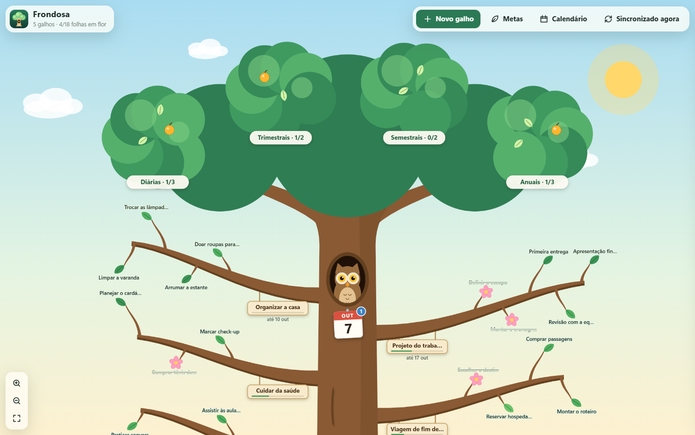

# Frondosa

[](https://joaogabrielmontinirossi-sys.github.io/frondosa/)

Um organizador em forma de árvore, para Windows, site e celular. As **tarefas são galhos** grossos que terminam em ramos finos (as subtarefas), as **metas pessoais** ficam nas folhas da copa e o **calendário** mora no oco da coruja, no meio do tronco. Sincroniza entre aparelhos pelo Google Drive.

## Baixar (Windows)

Pegue o `Frondosa.exe` na página de [Releases](../../releases/latest) e abra. Não precisa instalar nada: o programa usa o Edge (ou o Chrome) que já está no Windows para mostrar a janela.

Como o arquivo não é assinado, o Windows pode mostrar o aviso do SmartScreen na primeira vez: clique em **Mais informações** e depois em **Executar assim mesmo**.

## No site e no celular

Abra **https://joaogabrielmontinirossi-sys.github.io/frondosa/** em qualquer navegador.

- **Android (Chrome)**: abra **Ajustes › Instalar o aplicativo** (ou ⋮ › *Instalar app*). A Frondosa ganha ícone na tela inicial e abre em tela cheia.
- **iPhone/iPad (Safari)**: toque em **Compartilhar** › **Adicionar à Tela de Início**.

Depois de aberta uma vez, a versão web funciona sem internet. No celular, arraste com um dedo para passear pela árvore e faça a pinça para ampliar.

## Como a árvore funciona

| Na árvore | É | Como usar |
| --- | --- | --- |
| **Galho grosso** com plaquinha | Uma tarefa | Clique no galho para abrir: nome, prazo, anotações e ramos |
| **Ramo fino** com uma folha | Uma subtarefa | Clique na folha para concluir: ela vira flor |
| **Galho em flor** | Tarefa concluída | Em Ajustes dá para podar de uma vez os galhos concluídos |
| **Copas** no alto | Metas diárias, trimestrais, semestrais e anuais | Cada meta é uma folha; ao cumprir, vira fruto |
| **Oco da coruja** | Calendário | Eventos, prazos dos galhos e os dias em que as metas diárias foram cumpridas |

- As metas diárias repetem todo dia e recomeçam à meia-noite; as demais valem para o período atual, ou voltam a cada período se a repetição estiver ligada.
- A plaquinha de cada galho mostra o progresso e o prazo (em vermelho quando atrasado).
- Tema de dia e de noite (com lua, estrelas e os olhos da coruja acesos), automático conforme o sistema.
- Roda do mouse ou pinça para ampliar, arrastar para mover, e um botão para ver a árvore inteira.

## Sincronização

Funciona como no [Alvorada](https://github.com/joaogabrielmontinirossi-sys/alvorada.jgmrossi) e no [Ishikawa](https://github.com/joaogabrielmontinirossi-sys/ishikawa):

1. **Pasta do Google Drive para computador** (só no `.exe`): a Frondosa grava `frondosa-sync.json` em `Meu Drive\Frondosa` a cada alteração, e o Drive leva aos outros computadores. Se o Google Drive para computador estiver instalado, já começa ligada. Em **Ajustes** dá para desativar, trocar de conta (cada unidade G:, H:… é uma conta) ou escolher outra pasta sincronizada (OneDrive, Dropbox…).
2. **Conta Google** (`.exe`, site e celular): o mesmo arquivo fica na área privada do aplicativo no seu Google Drive. Precisa de um “ID do cliente OAuth” gratuito, criado uma vez só; o passo a passo está em **Ajustes**. Pode ser o mesmo ID dos outros aplicativos, bastando acrescentar a origem `http://localhost:47877`.

Alterações feitas em dois aparelhos são mescladas por registro: vale a versão mais recente de cada galho, meta ou evento, e as exclusões também são propagadas. Sem sincronização, os dados ficam só no aparelho; use **Ajustes › Exportar backup** para levar tudo a outro lugar.

## Compilar

Só precisa do Windows (usa o compilador C# do .NET Framework e o Edge, que já vêm instalados):

```powershell
powershell -ExecutionPolicy Bypass -File .\build.ps1
```

Gera `dist\Frondosa.exe` e `dist\frondosa.html` (versão em arquivo único, que abre em qualquer navegador; nela a sincronização não está disponível, apenas o backup).

| Pasta | Conteúdo |
| --- | --- |
| `app/` | O aplicativo (HTML, CSS e JavaScript puros, sem dependências). `tree.js` desenha a árvore em SVG |
| `desktop/Frondosa.cs` | Programa de Windows: serve o app em `localhost` e grava a pasta de sincronização |
| `build.ps1` | Gera os ícones a partir de `app/logo.svg`, compila o `.exe` e monta o arquivo único |
| `.github/workflows/` | Publica o site no GitHub Pages e o `.exe` em Releases a cada envio para a `main` |

## Licença

[MIT](LICENSE): pode usar, copiar, modificar e distribuir livremente, mantendo o aviso de autoria.
